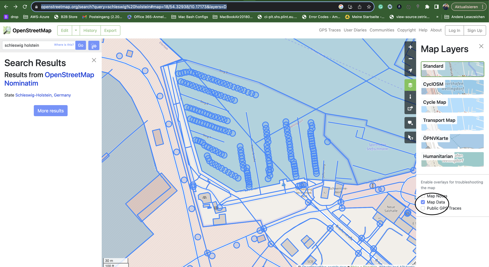
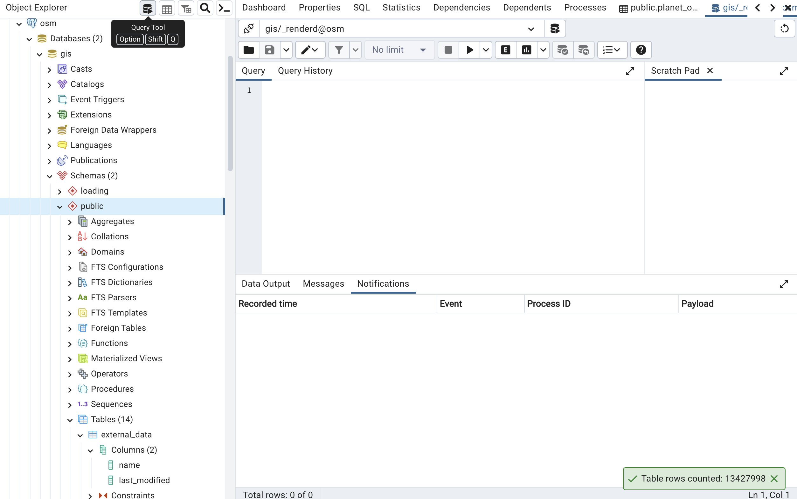

# Tile Server based on OSM Stack

! Work in Progress !

## Content

This repository is a starting point to get a deep dive into OSM Development. It is based on the [switch2osm](https://switch2osm.org/serving-tiles/manually-building-a-tile-server-ubuntu-22-04-lts/) installation instructions.

### Components

  * PostgreSQL
  * Postgis
  * osm2pgsql
  * carto
  * mapnik
  * renderd
  * libapache2-mod-tile
  * leaflet
  * pgAdmin4
  * Mailpit

## Prequesites

### VirtualBox

  * Install the latest virtualbox from oracle repositories (https://www.virtualbox.org/wiki/Downloads)
  * If you are on a linux distro, follow the instructions to add the oracle repo
  * Install the latest Oracle VM VirtualBox Extension Pack

#### Homebrew

```
brew install --cask virtualbox
```

### Vagrant

#### Homebrew

```
brew install vagrant
```

#### cli

  * Install the latest vagrant (https://www.vagrantup.com/downloads.html)

#### plugins

The vagrant machines depends on the following vagrant plugins.

```
vagrant plugin install vagrant-vbguest
vagrant plugin install vagrant-hostmanager
```

These plugins should get installed automatically on a "vagrant up", if that fails anyways, please manually install the plugins by entering the commands.

## Usage

### Upstart

  * Clone the repo and change to the directory
  * Run the machine

```
vagrant up
```

### Reset

Make sure, that you clean up the osm-dat directory, after a vagrant destroy.

### Browse

If you havn't changed the test domains in config.yml and custom_vars.yml, you can open osm, mailpit and pgadmin4 the following way:

  * http://osm.lokal
  * http://mail.osm.lokal
  * http://pgadmin.osm.lokal

#### pgAdmin4 Database Access

##### Login credentials

The default credentials are:

  * Email: admin@pgadmin.osm.lokal
  * Password: admin

The credentials can be changed in /ansible_vagrant/playbook.yml

##### Database Access

Create new server -> set the name (e.g. osm)

Tab Connection

  * Host: localhost
  * Port: 5432
  * Maintenance Database: gis
  * Username: _renderd
  * Password: renderd.secret

### Postgres

Some Postgres CLI Commands

```
sudo -u postgres -i
psql
\c gis
\dn
\dt+
```

## Edit Data

The original OSM Data does support seamarks, but does currently not display them by default. You can have a look at the existing data for the harbor of wellingdorf (all piles for the harbor do exist in the dataset).



https://www.openstreetmap.org/#map=18/54.32911/10.17075&layers=D

To add/edit the piles, use the following link:

https://www.openstreetmap.org/edit#map=21/54.32957/10.17308

Watch the video to see, how piles are being created.

[create piles](images/create_mooring_pile.mov)

<video width="320" height="240" controls>
  <source src="https://github.com/andrelohmann/vagrant_osm/raw/main/images/create_mooring_pile.mov" type="video/mp4">
</video>

## Enrich the tile rendering

Our first goal, is to get the added seamarks (piles) rendered within our map tiles. Therefor some research was necessary and some cartoCSS customization. All the steps to get to the result, are explained in detail.

### Step 1

In the first place, we will support moorings of category

  * dolphin
  * bollard
  * pile
  * post

These can be extracted from the following link

https://wiki.openstreetmap.org/wiki/Tag:seamark:type%3Dmooring

Therefor all new added Points need

  * feature type: Point
  * seamark:type = mooring
  * seamark:mooing:category = dolphin/bollard/pile/post

### Step 2

Each seamark is represented by an icon, that can be extracted from [Categories list](https://wiki.openstreetmap.org/wiki/Tag:seamark:type%3Dmooring).

We will examplarily showcase the process with the pile icon (Post.png).

  * Select the Category "Post or pile"
  * Click on the icon in the "Rendering" column
  * Right click on the thumbnail and save to ansible_vagrant/roles/osm_tile_server/files

### Step 3

Analyze the downloaded osm data

#### Osmium

osmium is installed to the vagrant machine and can be used to transform the *.osm.pbf to a human readable *.osm format (xml).

```
cd /opt/osm/data/
osmium cat schleswig-holstein-latest.osm.pbf -o schleswig-holstein-latest.osm
less schleswig-holstein-latest.osm
```

We will find our created piles as nodes in the osm file.

```
<node id="1830807368" version="4" timestamp="2023-08-27T19:56:40Z" lat="54.3295503" lon="10.1774222">
  <tag k="seamark:mooring:category" v="pile"/>
  <tag k="seamark:type" v="mooring"/>
</node>
```

This data will be imported into the postgres database via osm2pgsql. This happens during the ansible deployment in step "[Import openstreetmap data](https://github.com/andrelohmann/vagrant_osm/blob/main/ansible_vagrant/roles/osm_tile_server/tasks/main.yml#L141)" (ansible_vagrant/roles/osm_tile_server/tasks/main.yml).

### Step 4

Analyse the database.

#### pdAdmin

Login to pgAdmin as described in the Usage -> Browse -> pgAdmin chapter.

Select Databases -> gis -> public Schema and use the "Query Tool" to analyse the database tables.



We will find our piles in the planet_osm_point table.

```
SELECT * FROM planet_osm_point WHERE tags @> 'seamark:type=>mooring' AND tags @> 'seamark:mooring:category=>pile'
```

### Step 5

Our renderd service will make use of the mapnik python library. The mapnik library itself makes use of the CartoCSS stylesheet to generate the map tiles. Therefor by manipulating the CartoCSS stylesheet, we can influence the rendering process.

Following CartoCSS folders and files are important:

  * /opt/osm/src/openstreetmap-carto/project.mml
  * /opt/osm/src/openstreetmap-carto/style/*
  * /opt/osm/src/openstreetmap-carto/symbols/*

We need to copy our seamark icons to /opt/osm/src/openstreetmap-carto/symbols/. Then we need to create a custom .mss file in /opt/osm/src/openstreetmap-carto/style/ and then we need to add the new seamarks as an additional layer to /opt/osm/src/openstreetmap-carto/project.mml before the project.mml is transformed into a mapnik.xml file via the "carto" command.

These steps can be found in osm_tile_server role (ansible_vagrant/roles/osm_tile_server/tasks/main.yml).

  * [Add dolphin icon to /opt/osm/src/openstreetmap-carto/symbols/custom_seamark_mooring](https://github.com/andrelohmann/vagrant_osm/blob/main/ansible_vagrant/roles/osm_tile_server/tasks/main.yml#L51)
  * [Add bollard icon to /opt/osm/src/openstreetmap-carto/symbols/custom_seamark_mooring](https://github.com/andrelohmann/vagrant_osm/blob/main/ansible_vagrant/roles/osm_tile_server/tasks/main.yml#L59)
  * [Add pile icon to /opt/osm/src/openstreetmap-carto/symbols/custom_seamark_mooring](https://github.com/andrelohmann/vagrant_osm/blob/main/ansible_vagrant/roles/osm_tile_server/tasks/main.yml#L67)
  * [Add post icon to /opt/osm/src/openstreetmap-carto/symbols/custom_seamark_mooring](https://github.com/andrelohmann/vagrant_osm/blob/main/ansible_vagrant/roles/osm_tile_server/tasks/main.yml#L75)
  * [Add custom_seamark_mooring.mss to carto /opt/osm/src/openstreetmap-carto/style](https://github.com/andrelohmann/vagrant_osm/blob/main/ansible_vagrant/roles/osm_tile_server/tasks/main.yml#L42)
  * [Add custom_seamarks.mss Style to carto project.mml](https://github.com/andrelohmann/vagrant_osm/blob/main/ansible_vagrant/roles/osm_tile_server/tasks/main.yml#L83)
  * [Add custom_seamark_mooring Layer to carto project.mml](https://github.com/andrelohmann/vagrant_osm/blob/main/ansible_vagrant/roles/osm_tile_server/tasks/main.yml#L90)
  * [Create the mapnik.xml](https://github.com/andrelohmann/vagrant_osm/blob/main/ansible_vagrant/roles/osm_tile_server/tasks/main.yml#L134)

Studying of the existing layers and style/*.mss files is definetly helpful, to figure out, how to setp your own layers.

## Prerendering

All tiles can be prerendered with render_list

```
sudo -u _renderd render_list --all --num-threads=4 --map=s2o --min-zoom=0 --max-zoom=20
```

https://manpages.ubuntu.com/manpages/jammy/man1/render_list.1.html


## Debugging

```
cd /opt/osm/src/openstreetmap-carto/
carto project.mml > mapnik.xml
rm rf /var/cache/renderd/tiles/*
systemctl restart renderd
journalctl -u renderd
```

## Links

  * https://wiki.openstreetmap.org/wiki/DE:Mapnik
  * https://wiki.openstreetmap.org/wiki/OpenStreetMap_Carto
  * https://wiki.openstreetmap.org/wiki/CartoCSS
  * https://wiki.openstreetmap.org/wiki/OpenStreetMap_Carto/Symbols
  * https://github.com/gravitystorm/openstreetmap-carto/blob/master/USECASES.md
  * https://ircama.github.io/osm-carto-tutorials/editing-guidelines/
  * https://wiki.openstreetmap.org/wiki/PostgreSQL
  * https://wiki.openstreetmap.org/wiki/PostGIS
  * https://osm2pgsql.org/

## Todo

### Add Drone images overlay to editor

  * https://blog.mapbox.com/drone-imagery-for-openstreetmap-18a30565b744
  * https://www.mapbox.com/industries/drones
  * https://www.dji.com/de/downloads/products/ground-station-pro
  * https://docs.opendronemap.org/tutorials/
  * https://docs.openaerialmap.org/
  * https://github.com/maptiler/tileserver-php
  * https://geoserver.org/tips%20and%20tricks/tutorials/2009/01/30/geoserver-and-openstreetmap.html
    
#### Drone Image Mapping Software

  * https://flylitchi.com/
  * https://www.youtube.com/watch?v=IMt-Ow00yEw
  * https://www.qgis.org/de/site/
  * https://opendronemap.org/
  * https://dronesmadeeasy.com/map-pilot
  * https://www.mapsmadeeasy.com/
  * https://www.youtube.com/watch?v=kZRXH9uNhoA
  * https://www.youtube.com/watch?v=UdqMAfBXxC4
  * https://www.youtube.com/watch?v=B6osz-cBw2o

### Ad polygons for harbor data

https://osmand.net/docs/technical/map-creation/creating-a-country-polygon/

Polygons allow to extract a subset of a map set e.g. take a schleswig-holstein polygon to extract only schleswig-holstein from the germany map, or use a harbour polygon, to extract just the data of a harbour.

## License

MIT

## Author Information

&copy; Andre Lohmann (and others) 2023

https://github.com/andrelohmann

### Maintainer Contact

 * Andre Lohmann
  <lohmann.andre (at) gmail (dot) com>
